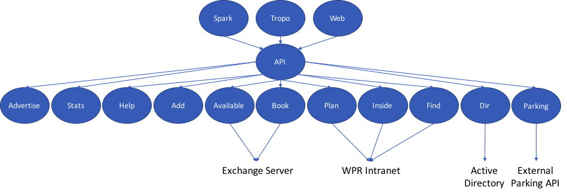

Roomfinder
==========

Micro-services based application for finding free physical conference rooms from a Microsoft Exchange Server, but not only.

This application was developped by Guillaume Morini and Remy Cronier

This application includes a web server, a chatbot for Cisco Spark

Requirements:
 - Docker with Python 2.7
 - Access to Exchange Web Service (EWS) API of a Microsoft Exchange Server 2010 

The application has to be deployed on at least 2 hosts with different network requirements:
 - one with network connectivity to Internet to host webhooks for Spark and Tropo
 - one with network connectivity to Exchange and directory servers

Here is the Roomfinder micro-services architecture:

